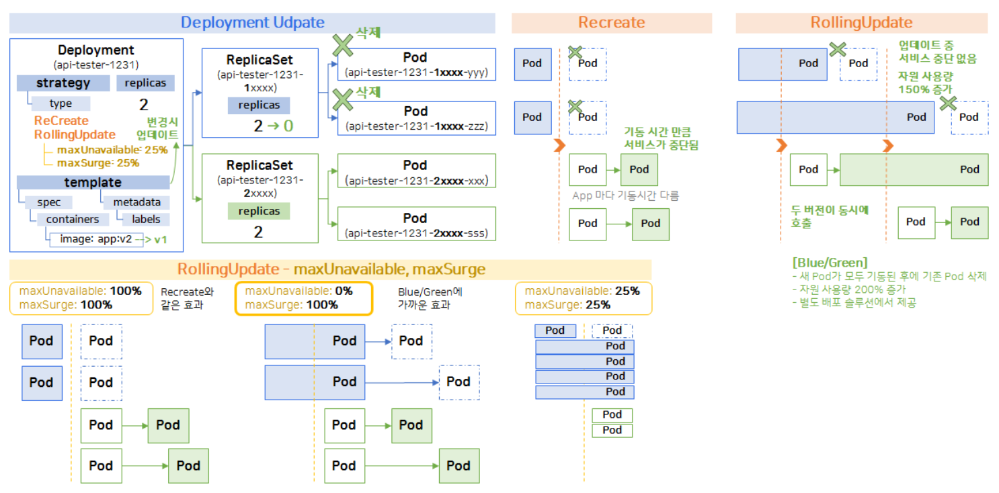
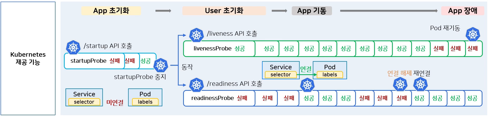
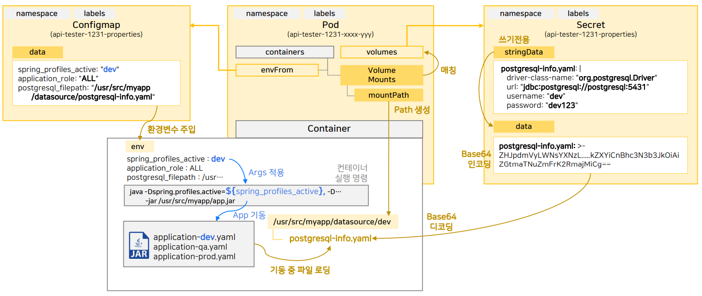
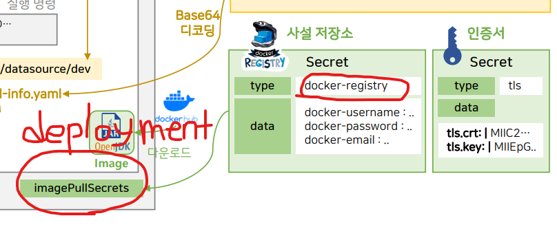

## K8s obj template storage

----

### Object, 오브젝트

#### Namespace
```yaml
apiVersion: v1
kind: Namespace
metadata:
  name: order-platform # Namespace 정의
  labels:
    part-of: k8s-order-platform
    managed-by: dashboard
```
 - Namespace level Object 그룹핑

#### Deployment
```yaml
apiVersion: apps/v1
kind: Deployment
metadata:
  namespace: order-platform # Namespace 할당 
  name: api-tester-1231 # Namespace 내에서 name 값을 중복되면 안됨
  labels:
    part-of: k8s-order-platform
    component: backend-server
    name: api-tester
    instance: api-tester-1231
    version: 1.0.0
    managed-by: dashboard
spec:
  selector:
    matchLabels:
      part-of: k8s-order-platform
      component: backend-server
      name: api-tester
      instance: api-tester-1231
  replicas: 2 # Pod 초기 생성 개수
  strategy: # Deployment 배포 전략
    type: RollingUpdate
  template: # Pod 생성 Template
    metadata:
      labels:
        part-of: k8s-order-platform
        component: backend-server
        name: api-tester
        instance: api-tester-1231
        version: 1.0.0
    spec:
      nodeSelector: # Pod 오브젝트가 생성될 Node를 직접 선택
        kubernetes.io/hostname: k8s-master
      containers:
        - name: api-tester-1231
          image: 1pro/api-tester:v1.0.0 # 이미지 다운로드
          ports:
          - name: http
            containerPort: 8080
          envFrom: # Application 환경변수를 위해 Configmap 오브젝트와 연결
            - configMapRef:
                name: api-tester-1231-properties
          startupProbe: # Application 기동이 잘 되었는지 확인하고 기동되지 않으면 재기동 / 정상 기동되면 readinessProbe, livenessProbe를 실행 
            httpGet:
              path: "/startup"
              port: 8080
            periodSeconds: 5
            failureThreshold: 36
          readinessProbe: # Application에 트래픽을 연결하기 위한 테스트
            httpGet:
              path: "/readiness"
              port: 8080
            periodSeconds: 10
            failureThreshold: 3
          livenessProbe: # Application이 정상이 아니면 재기동
            httpGet:
              path: "/liveness"
              port: 8080
            periodSeconds: 10
            failureThreshold: 3
          resources: # Pod 자원설정
            requests:
              memory: "100Mi"
              cpu: "100m"
            limits:
              memory: "200Mi"
              cpu: "200m"
          volumeMounts: # Pod 내부에 만들어지는 디렉토리
            - name: files # volumes.name 매칭
              mountPath: /usr/src/myapp/files/dev
            - name: secret-datasource # volumes.name 매칭
              mountPath: /usr/src/myapp/datasource
      volumes:
        - name: files # volumeMounts.name 매칭
          persistentVolumeClaim: # PVC 오브젝트 구성
            claimName: api-tester-1231-files
        - name: secret-datasource # volumeMounts.name 매칭
          secret: # Secret 오브젝트 구성
            secretName: api-tester-1231-postgresql
```

 - Deployment 오브젝트를 통해 생성되는 ReplicaSet 오브젝트와 Pod 오브젝트는 네이밍을 상속받는다.
   - Deployment.name: `test-123`
   - ReplicaSet.name: `test-123-xxx` (Deployment.name 네이밍 상속, xxx는 임의 문자)
   - Pod.name: `test-123-xxx-yyy` (ReplicaSet.name 네이밍 상속, yyy는 임의 문자)
 - probe 속성
   
   - Pod 오브젝트가 생성되자 마자 probe 기능이 동작한다.
   - startupProbe: 
     - Application이 기동되자마자 path에 설정된 경로를 failureThreshold(임계치)까지 호출한다.
     - 성공 응답을 받으면 readinessProbe와 livenessProbe를 실행시킨다.  
   - readinessProbe: 
     - 성공 응답을 받으면 외부 트래픽을 Pod가 받을 수 있는 상태 전환한다.
     - **Service 오브젝트와 연결이 주 목적**
   - livenessProbe: 
     - 서비스가 정상 기동 상태인지 체크한다.
     - **Pod 오브젝트 재기동이 주 목적**
 > 일반적으로 livenessProbe를 readinessProbe 보다 체크주기를 길게 설정하여 Pod 재기동이 쉽게 되는것을 방지하는 것이 좋다.

#### Service
```yaml
apiVersion: v1
kind: Service
metadata:
  namespace: anotherclass-123
  name: api-tester-1231
  labels:
    part-of: k8s-order-platform
    component: backend-server
    name: api-tester
    instance: api-tester-1231
    version: 1.0.0
    managed-by: dashboard
spec:
  selector:
    part-of: k8s-order-platform
    component: backend-server
    name: api-tester
    instance: api-tester-1231
  ports:
    - port: 80
      targetPort: http
      nodePort: 31231
  type: NodePort
```
 - Pod 오브젝트로 트래픽을 연결시켜주는 역할
 - 

#### Configmap
```yaml
apiVersion: v1
kind: ConfigMap
metadata:
  namespace: anotherclass-123
  name: api-tester-1231-properties
  labels:
    part-of: k8s-order-platform
    component: backend-server
    name: api-tester
    instance: api-tester-1231
    version: 1.0.0
    managed-by: dashboard
data:
  spring_profiles_active: "dev"
  application_role: "ALL"
  postgresql_filepath: "/usr/src/myapp/datasource/postgresql-info.yaml"
```

 - Pod 오브젝트로 환경변수를 제공하는 역할 
 - 환경변수 Configmap은 Pod가 생성될 때, **최초의 한번**만 주입

#### Secret
```yaml
apiVersion: v1
kind: Secret
metadata:
  namespace: anotherclass-123
  name: api-tester-1231-postgresql
  labels:
    part-of: k8s-order-platform
    component: backend-server
    name: api-tester
    instance: api-tester-1231
    version: 1.0.0
    managed-by: dashboard
stringData:
  postgresql-info.yaml: |
    driver-class-name: "org.postgresql.Driver"
    url: "jdbc:postgresql://postgresql:5431"
    username: "dev"
    password: "dev123"
```
 - Pod 오브젝트로 시크릿 변수를 제공하는 역할
 - tls 인증서
 - **또는 private image registry(Harbor)에 접근하여 이미지를 받아오는 경우에 많이 사용됨.**
    
    ```yaml
    apiVersion: apps/v1
    kind: Deployment
    metadata:
      name: my-app-deployment
      labels:
        app: my-app
    spec:
      replicas: 3
      selector:
        matchLabels:
          app: my-app
      template:
        metadata:
          labels:
            app: my-app
        spec:
          containers:
          - name: my-app-container
            image: harbor.example.com/my-project/my-app:latest  # Harbor에서 이미지 가져옴
            ports:
            - containerPort: 8080
          imagePullSecrets:
          - name: harbor-registry-secret  # Harbor 레지스트리 인증 정보
    ```
    
    ```commandline
    kubectl create secret docker-registry harbor-registry-secret \
      --docker-server=harbor.example.com \
      --docker-username=your-username \
      --docker-password=your-password \
      --docker-email=your-email@example.com
    ```

#### PVC
```yaml
apiVersion: v1
kind: PersistentVolumeClaim
metadata:
  namespace: anotherclass-123
  name: api-tester-1231-files
  labels:
    part-of: k8s-order-platform
    component: backend-server
    name: api-tester
    instance: api-tester-1231
    version: 1.0.0
    managed-by: kubectl
spec:
  resources:
    requests: # 저장공간 설정
      storage: 2G
  accessModes: # 접근 R/W 설정
    - ReadWriteMany
  selector:
    matchLabels:
      part-of: k8s-order-platform
      component: backend-server
      name: api-tester
      instance: api-tester-1231-files
```
 - Pod 오브젝트의 PV를 지정하는 역할

#### PV
```yaml
apiVersion: v1
kind: PersistentVolume
metadata:
  name: api-tester-1231-files
  labels:
    part-of: k8s-order-platform
    component: backend-server
    name: api-tester
    instance: api-tester-1231-files
    version: 1.0.0
    managed-by: dashboard
spec:
  capacity:
    storage: 2G
  volumeMode: Filesystem
  accessModes:
    - ReadWriteMany
  local: # Volume으로 사용하려는 경로
    path: "/root/k8s-local-volume/1231"
  nodeAffinity: # master-node 지정
    required:
      nodeSelectorTerms:
        - matchExpressions:
            - {key: kubernetes.io/hostname, operator: In, values: [k8s-master]}
```
 - 실제 Volume을 지정
 - Cluster level의 오브젝트(Namespace 영역에 속하지 않음)

#### HPA
```yaml
apiVersion: autoscaling/v2
kind: HorizontalPodAutoscaler
metadata:
  namespace: anotherclass-123
  name: api-tester-1231-default
  labels:
    part-of: k8s-order-platform
    component: backend-server
    name: api-tester
    instance: api-tester-1231
    version: 1.0.0
    managed-by: dashboard
spec:
  scaleTargetRef:
    apiVersion: apps/v1
    kind: Deployment
    name: api-tester-1231 # Deployment 오브젝트 지정
  minReplicas: 2 # 최소 Pod
  maxReplicas: 4 # 최대 Pod
  metrics:
    - type: Resource
      resource:
        name: cpu
        target:
          type: Utilization
          averageUtilization: 60
  behavior: # Pod가 스케일아웃되고 120초동안은 증가되지 않음
    scaleUp:
      stabilizationWindowSeconds: 120
```
 - 부하에 따라 auto scaling

----

### labels 명명 컨벤션
k8s에서 권고하는 Label 명명 규칙이 있다.

```yaml
labels:
  part-of: {application 전체 이름}
  component: {구성요소}
  name: {application 이름}
  instance: {익스턴스 식별}
  version: {버전}
  managed-by: {배포도구}
```

```yaml
labels:
  part-of: kube-prometheus
  component: prometheus
  name: prometheus
  instance: k8s
  version: 2.44.0
  managed-by: helm
```

```yaml
labels:
  part-of: kube-prometheus
  component: exporter
  name: node-exporter
  instance: k8s
  version: 2.44.0
```

```yaml
labels:
  part-of: kube-prometheus
  component: exporter
  name: kube-state-metrics
  instance: k8s-1
  version: 2.44.0
```

```yaml
labels:
  part-of: kube-prometheus
  component: exporter
  name: kube-state-metrics
  instance: k8s-2
  version: 2.44.0
```

labels는 selector와 매칭되어 두 오브젝트를 연결하는데 사용되기도 한다.  
selector의 내용이 labels에 **모두** 포함되어 있어야 연결된다.  
즉, 유니크한 값을 매핑시켜주기 위해 selector의 내용으로 instance만 넣어주는것으로 사용되곤 한다.

 문자 그대로 받아들이면 이해하기 좋다. selector가 labels를 골라서 선택하는 것이라서 selecor의 모든 내용을 만족하는 labels를 찾아야 한다.


